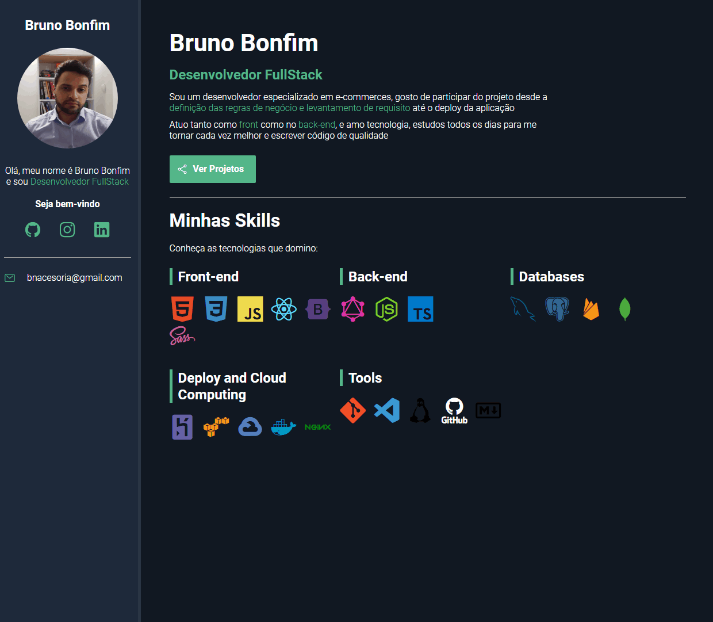

# Portifolio_GitPages
Portfólio Dev em HTML e CSS Puro para teste de deploy GitPages

#

### Deploy Page

> [Portifólio GitPages](https://brunonavarrooficial.github.io/Portifolio_GitPages/)

### Skills

> HTML
* Tags Semânticas

> CSS
* Flex-Box
* Media Query
* Váriaveis de ambiente **_`Root:`_**

> Bibliotécas Externas:
* [Ionic Icons](https://ionic.io/ionicons/usage)
* [Google Fonts](https://fonts.google.com/about)
* [DevIcons](https://devicon.dev/)

#

<h3>Projeto:</h3>

#

<h3>Projeto Responsivo:</h3>

